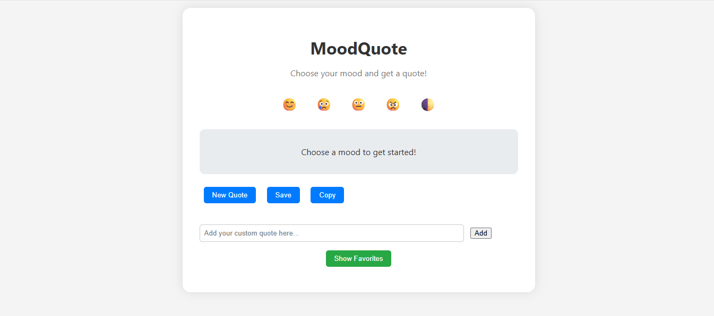

# Hi, I'm Harsh Mishra! 👋

## 🚀 I'm a full-stack developer...

## Project Title - 

## MoodQuote Web App 🌈

**MoodQuote** is a lightweight and interactive web app that provides inspirational quotes based on your current mood. Whether you're happy, sad, neutral, or angry — this app delivers a quote to match your feelings. You can also save your favorite quotes, copy them, and even add your own custom quotes.

---

## 🔥 Features

- 🎭 Select your mood: Happy, Sad, Neutral, Angry
- 📜 Get a quote that fits your mood
- 🔁 Generate new quotes anytime
- ❤️ Save your favorite quotes (stored in browser)
- ✍️ Add custom quotes for each mood
- 📋 Copy quotes to clipboard
- 🌙 Toggle between Light & Dark mode

---

## Average time to complete
#### 4 hrs

## 🖼️ Preview

---

## Demo | Netlify
https://warm-druid-e3e04e.netlify.app/

## 🚀 Technologies Used

- **HTML5**
- **CSS3** (Responsive design + Dark Mode)
- **Vanilla JavaScript** (No frameworks)
- **LocalStorage** for saving favorites

---

## 📁 Project Structure

MoodQuote/
│
├── index.html # Main HTML page
├── style.css # All styling (light/dark mode)
├── script.js # Core JS logic (quotes, storage, etc.)
├── image.png
└── README.md # Project documentation

## 🤝 Contributing

Contributions are welcome! If you'd like to improve this project, feel free to submit a pull request or open an issue for discussion.

👨‍💻 Author
Harsh Mishra
📧 harshmishra0068@gmail.com
🌐 GitHub: HarshMishra23